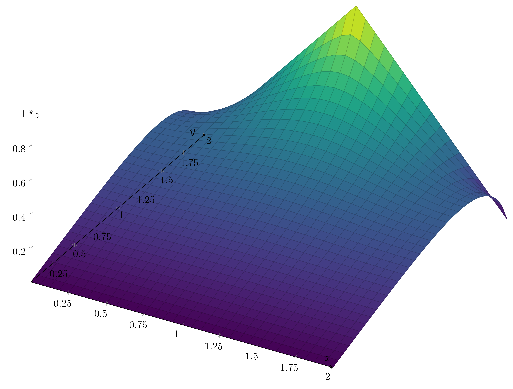

# EDMNA
Software application of numerical methods (Euler, Heun and finite differences) to solve an _initial value problem_ coded in MatLab that output text that can be used to graph the solution in LaTeX.

## Procedure
The first aproach to the challenge was using MatLab as a reccomendation of our professor. Through it we obtained as an output that we pasted in an _.txt_ file for each lenght of step. Worked with LaTeX through overleaf.com free plan reading _.txt_ documents with the coordinates in an specific format that LaTeX could work with.

